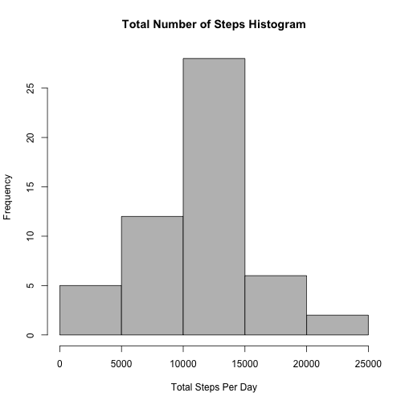
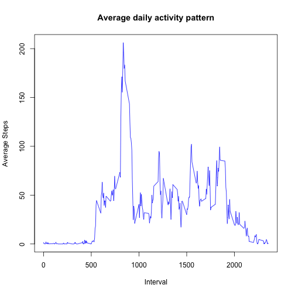
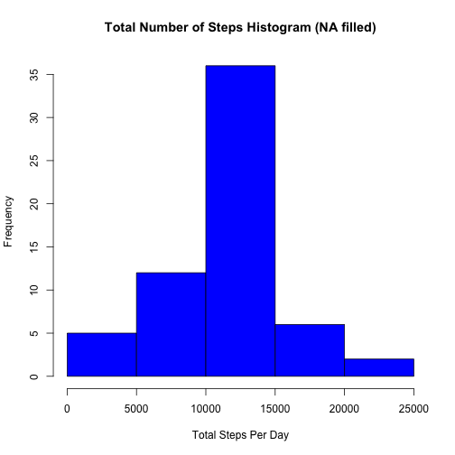

Reproducible Research: Peer Assessment 1
========================================

This document is for project 1 in Reproducible Research.


```r
# set "echo=TRUE" as global option
library("knitr")
opts_chunk$set(echo=TRUE)
```


## 1.   Loading and preprocessing the data


```r
data <- read.csv("activity.csv",colClasses=c("numeric","character","numeric"))
sapply(data,class)
```

```
##       steps        date    interval 
##   "numeric" "character"   "numeric"
```

```r
data$date <- as.Date(data$date,"%Y-%m-%d")
```


## 2.   What is mean total number of steps taken per day?

### 1) Calculate the total number of steps taken per day.
Missing Values are ignored.

```r
TotalSteps <- aggregate(steps ~ date, data=data, sum, na.rm=TRUE)
head(TotalSteps)
```

```
##         date steps
## 1 2012-10-02   126
## 2 2012-10-03 11352
## 3 2012-10-04 12116
## 4 2012-10-05 13294
## 5 2012-10-06 15420
## 6 2012-10-07 11015
```

### 2) Histogram of total number of steps taken per day.

```r
hist(TotalSteps$steps, main="Total Number of Steps Histogram",
     xlab ="Total Steps Per Day", ylab="Frequency", col="gray")
```

 

### 3) Calculate the mean and median of total number of steps taken per day.

```r
TotalStepsMean <- mean(TotalSteps$steps)
TotalStepsMedian <- median(TotalSteps$steps)
```

The mean is:

```r
TotalStepsMean
```

```
## [1] 10766.19
```

The median is:

```r
TotalStepsMedian
```

```
## [1] 10765
```

## 3.   What is the average daily activity pattern?
Calculate the 5-minute interval and the average number of steps taken, averaged across all days.  
Missing values are ignored.

```r
MeanSteps <- aggregate(steps ~ interval, data=data, mean, na.rm=TRUE)
plot(MeanSteps$interval, MeanSteps$steps,type="l", 
     main="Average daily activity pattern", 
     xlab="Interval", ylab="Average Steps",col="blue")
```

 

```r
head(MeanSteps$interval, 30)
```

```
##  [1]   0   5  10  15  20  25  30  35  40  45  50  55 100 105 110 115 120
## [18] 125 130 135 140 145 150 155 200 205 210 215 220 225
```

Note from the above plot that there is a jump of data values at the end of each hour. This is caused by using intervals as straight interval index instead of time. For example, from the above interval data, we can see that 55 is followed by 100 and 155 is followed by 200. The best way is to regard the interval as time instead of index so that the plot is smoother and more meaningful. However, to be consistent with the given example plot from the instructor, the interval is still being plotted as index here.  


Maximum number of steps happened at the following interval:

```r
MeanSteps$interval[which.max(MeanSteps$steps)]
```

```
## [1] 835
```

## 4.   Imputing missing values
### 1) Calculate the total number of missing values in the dataset

```r
TotalMissing <- sum(is.na(data))
TotalMissing
```

```
## [1] 2304
```

### 2) Fill the missing values by the corresponding mean of the 5-minute interval and create a new dataset

```r
#MeanSteps$steps
#MeanSteps$interval

data_fill <- data
for (i in 1:nrow(data)){
    if(is.na(data$steps[i])){
        data_fill$steps[i] <- subset(MeanSteps,interval==data_fill$interval[i])$steps
    }
}
```
### 3) Make the histogram of total number of steps taken.


```r
TotalSteps_fill <- aggregate(steps ~ date, data=data_fill, sum, na.rm=TRUE)
hist(TotalSteps_fill$steps, main="Total Number of Steps Histogram (NA filled)",
     xlab ="Total Steps Per Day", ylab="Frequency", col="blue")
```

 

### 4) The mean and median of total of number of steps taken.

```r
TotalStepsMean_fill <- mean(TotalSteps_fill$steps)
TotalStepsMedian_fill <- median(TotalSteps_fill$steps)
TotalStepsMean_fill
```

```
## [1] 10766.19
```

```r
TotalStepsMedian_fill
```

```
## [1] 10766.19
```

The mean is the same, but the median changes a little bit. However, even though the mean and median
values of the dataset is not changed much, the total number of steps taken each day might be increased
for certain days from replacing NA by 5-minute interval means.

## 5.   Are there differences in activity patterns between weekdays and weekends?

```r
whichday <- function(date) {
    if (weekdays(as.Date(date)) %in% c("Saturday", "Sunday")) {
        "weekend"        
    } else {
        "weekday"
    }
}
data_fill$whichday <- as.factor(sapply(data_fill$date, whichday))

MeanSteps_fill <- aggregate(steps ~ interval + whichday, data=data_fill,
                            mean, na.rm=TRUE)

names(MeanSteps_fill)
```

```
## [1] "interval" "whichday" "steps"
```

```r
library(lattice)
xyplot(steps ~ interval | whichday, MeanSteps_fill, type="l",
       layout=c(1,2), xlab="Interval", ylab="Number of steps")
```

 

It can be seen from the above figure comparison that there are differences in the
activity patterns between weekdays and weekends. The most steps taken for weekdays mostly happen 
in the morning around 9am ~ 10am. While in weekends, the step peaks happen throughout the day.
We may assume from the results that this particular individual might tend to workout in
the morning in workdays and get more active in weekends throughout the day. 

